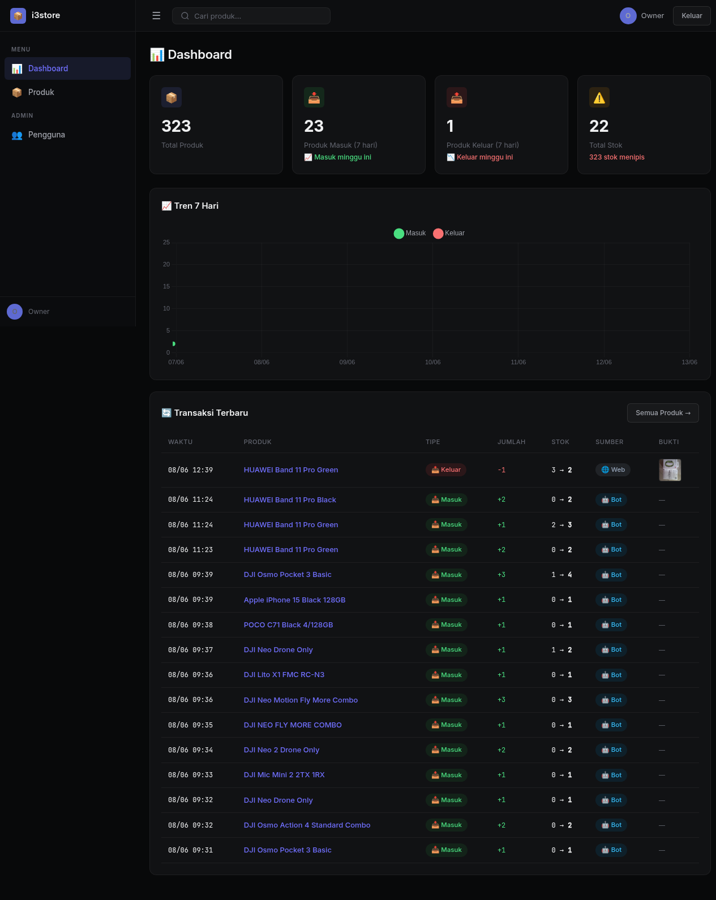

# 📦 i3store Inventory Management System

> **Production-grade inventory system for multi-platform e-commerce sellers**
>
> REST API • Web Dashboard • Telegram Bot • AI-Powered OCR

Built for real-world e-commerce operations managing products across Shopee, Tokopedia, and offline channels. Serves warehouse staff via Telegram bot with intelligent fuzzy product matching, and provides a modern web dashboard for owners with trend analytics and visual reports.

<p align="center">
  
</p>

---

## 🎯 The Problem

Indonesian e-commerce sellers face a fragmented reality:

- **Multiple platforms** — Shopee, Tokopedia, offline sales, each with separate stock tracking
- **Warehouse staff** — Need a dead-simple interface; WhatsApp/Telegram is their comfort zone
- **Shipping labels** — Hundreds of outgoing packages with labels that need manual data entry
- **Stock blind spots** — Owners have no real-time visibility into inventory across channels

This system solves all four in one unified platform.

---

## ✨ Features

### 🤖 Telegram Bot (`@i3storeBot`)

<p align="center">
  
</p>
- **AI-powered fuzzy matching** — Type "poco hitam" and it finds "POCO C71 BLACK 4/128GB"
- **Variant-aware matching** — Knows the difference between "iPhone 15 black" and "iPhone 15 white"
- **Inline keyboards** — Confirm/cancel stock movements with one tap
- **OCR label scanning** — Snap a photo of any shipping label (Shopee/Tokopedia/Lazada) → auto-extract product name, quantity, platform
- **Role-based access** — Only authorized Telegram usernames can interact
- **Duplicate detection** — SHA256 photo hashing prevents double-counting

### 🌐 Web Dashboard
- **Metric cards** — Total products, weekly in/out, low stock alerts
- **Trend charts** — 7-day stock movement visualization (Chart.js)
- **Real-time transactions** — Recent movements table with photo thumbnails
- **Product management** — CRUD with image galleries and stock history
- **User admin panel** — Owner can manage staff accounts (admin/viewer roles)
- **Linear dark theme** — Modern UI optimized for mobile & desktop

### 🔌 REST API
- Full CRUD for products, stock movements, and users
- JWT authentication with role-based authorization (owner/admin/viewer)
- File upload support for receipt/label photos
- Statistics endpoint for dashboard widgets

### 🧠 AI / OCR
- **OpenRouter Vision API** — Reads shipping labels with `google/gemma-3-27b-it`
- **Tesseract fallback** — Works offline when API is unavailable
- **Multi-platform label support** — Shopee, Tokopedia, TikTok Shop, Lazada, Bukalapak, Blibli
- Extracts: platform name, product name, quantity — all in one pass

---

## 🛠️ Tech Stack

| Layer | Technology |
|-------|-----------|
| **Backend** | Python 3.13, FastAPI |
| **Bot Framework** | python-telegram-bot 21.x |
| **Database** | SQLAlchemy 2.x + SQLite |
| **Auth** | JWT (python-jose), bcrypt (passlib) |
| **OCR** | OpenRouter Vision API + pytesseract |
| **Frontend** | Jinja2 templates, Chart.js, vanilla CSS |
| **Deploy** | systemd, Cloudflare Tunnel |
| **Server** | Uvicorn, self-hosted Linux |

---

## 🏗️ Architecture

```
┌──────────────────────────────────────────────────────┐
│                   Telegram Users                      │
│              (warehouse staff + owner)                │
└─────────────┬───────────────────────────────┬────────┘
              │                               │
              ▼                               ▼
     ┌────────────────┐             ┌─────────────────┐
     │  Telegram Bot   │             │  Web Dashboard   │
     │  webhook mode   │             │  (browser)       │
     └───────┬────────┘             └────────┬────────┘
             │                               │
             ▼                               ▼
     ┌─────────────────────────────────────────────────┐
     │              FastAPI Server (:5002)               │
     │  ┌───────────┐ ┌──────────┐ ┌────────────────┐  │
     │  │ Auth (JWT) │ │  CRUD    │ │  OCR Pipeline  │  │
     │  └───────────┘ └──────────┘ └────────────────┘  │
     └──────────────────────┬──────────────────────────┘
                            │
                            ▼
     ┌─────────────────────────────────────────────────┐
     │              SQLAlchemy ORM                       │
     │   Users │ Products │ StockMovements              │
     └──────────────────────┬──────────────────────────┘
                            │
                            ▼
     ┌─────────────────────────────────────────────────┐
     │                 SQLite (inventory.db)             │
     └─────────────────────────────────────────────────┘
```

---

## 🚀 Quick Start

### Prerequisites
- Python 3.10+
- Tesseract OCR (optional, for offline OCR fallback)
- Telegram Bot Token (from [@BotFather](https://t.me/BotFather))
- OpenRouter API key (optional, for AI vision OCR)

### Installation

```bash
git clone https://github.com/iankee/i3store-inventory.git
cd i3store-inventory

# Create virtual environment
python -m venv venv
source venv/bin/activate

# Install dependencies
pip install -r requirements.txt

# Install tesseract (optional)
sudo apt install tesseract-ocr tesseract-ocr-ind  # Ubuntu/Debian
```

### Configuration

Set environment variables:

```bash
export INV_SECRET_KEY="your-secret-key-here"
export INV_TELEGRAM_BOT_TOKEN="your-bot-token"
export INV_ALLOWED_USERS="telegram_username1,telegram_username2"
export INV_PORT=5002
# Optional: for AI-powered OCR
export OPENROUTER_API_KEY="sk-or-..."
```

### Run

```bash
# Start the server
uvicorn app:app --host 0.0.0.0 --port 5002

# In another terminal, start the Telegram bot
python bot.py
```

### Deploy (systemd)

```bash
sudo cp inventory.service /etc/systemd/system/
sudo cp inventory-bot.service /etc/systemd/system/
sudo systemctl enable --now inventory inventory-bot
```

---

## 📊 Project Structure

```
inventory/
├── app.py                  # FastAPI backend (860+ lines)
│                           #   Web routes, REST API, dashboard
├── bot.py                  # Telegram bot (1660+ lines)
│                           #   Fuzzy matching, OCR flow, keyboards
├── ocr.py                  # OCR pipeline (320+ lines)
│                           #   OpenRouter vision + tesseract fallback
├── models.py               # SQLAlchemy models
│                           #   Users, Products, StockMovements
├── auth.py                 # JWT auth + role-based access
├── config.py               # Environment configuration
├── requirements.txt        # Python dependencies
├── templates/              # Jinja2 HTML templates
│   ├── base.html           #   Layout shell (Linear dark theme)
│   ├── dashboard.html      #   Metrics + charts + transactions
│   ├── products.html       #   Product list with search
│   ├── product_detail.html #   Single product + stock history
│   ├── users.html          #   User management (owner)
│   └── login.html          #   Login page
├── static/
│   └── style.css           # Custom styling
└── uploads/                # Receipt and label photos
```

**Total: 3,000+ lines of production Python**

---

## 🔐 Security

- JWT token-based authentication with 8-hour expiry
- Role-based access control: `owner` > `admin` > `viewer`
- Telegram bot: whitelist-only, only authorized usernames can interact
- Photo deduplication via SHA256 hashing
- SQL injection protection via SQLAlchemy ORM
- All endpoints require valid JWT (except login)

---

## 📈 Scale & Impact

| Metric | Value |
|--------|-------|
| Products managed | 50+ active SKUs |
| Monthly transactions | 200+ stock movements |
| User roles | 3 (owner, admin, viewer) |
| Platforms tracked | Shopee, Tokopedia, offline |
| Uptime | 24/7 via systemd |

---

## 🔮 Future Roadmap

- [ ] PostgreSQL migration for multi-tenant support
- [ ] Shopee/Tokopedia API integration for automated order sync
- [ ] Real-time WebSocket notifications
- [ ] Profit margin analytics dashboard
- [ ] Barcode/QR scanner integration
- [ ] Docker Compose deployment

---

## 👤 Author

**IanKee Mualdo** — [Sricreate Web & Digital Solutions](https://sricreate.com)

- 💼 [LinkedIn](https://www.linkedin.com/in/iankee-mualdo-3a815154)
- 📧 contact@sricreate.com
- 📱 WhatsApp: +62 813-7072-0459

---

## 📄 License

MIT License — feel free to use, modify, and learn from this project.
